# OAuth 2.0 Authorization Flows

Based on RFC 6749 (The OAuth 2.0 Authorization Framework), this document outlines the four main authorization grant types with detailed sequence diagrams.

## 1. Authorization Code Grant

**Use Case**: Most secure flow for confidential clients (server-side applications)
**Security Level**: High - provides client authentication and separates authorization code from access token

**Parameters:**
- **Authorization Request**: `response_type=code`, `client_id`, `redirect_uri`, `scope`, `state`
- **Token Request**: `grant_type=authorization_code`, `code`, `redirect_uri`, `client_id`, `client_secret`

---

## 2. Implicit Grant - DEPRECATED

**Use Case**: Browser-based applications (SPAs) - **DEPRECATED in OAuth 2.1**
**Security Level**: Medium - no client authentication, token exposed in URI

**Parameters:**
- **Authorization Request**: `response_type=token`, `client_id`, `redirect_uri`, `scope`, `state`
- **Token Response**: `access_token`, `token_type`, `expires_in`, `scope`, `state`

---

## 3. Resource Owner Password Credentials Grant - DEPRECATED

**Use Case**: Highly trusted clients only (first-party applications) **DEPRECATED in OAuth 2.1**
**Security Level**: Low - requires sharing user credentials with client

**Parameters:**
- **Token Request**: `grant_type=password`, `username`, `password`, `client_id`, `client_secret`, `scope`

---

## 4. Client Credentials Grant

**Use Case**: Machine-to-machine authentication (no user involved)
**Security Level**: Medium - depends on client credential security

**Parameters:**
- **Token Request**: `grant_type=client_credentials`, `client_id`, `client_secret`, `scope`

---

## 5. Refresh Token Flow

**Use Case**: Obtaining new access tokens without user re-authentication
**Security Level**: High - allows long-term access with proper rotation

**Parameters:**
- **Refresh Request**: `grant_type=refresh_token`, `refresh_token`, `client_id`, `client_secret`, `scope`

---

## Security Considerations by Flow

### Authorization Code Grant
- ✅ **Most Secure**: Client authentication, code/token separation
- ✅ **Recommended for**: Server-side applications
- ✅ **Use with**: PKCE for public clients

### Implicit Grant
- ⚠️ **Deprecated**: Use Authorization Code + PKCE instead
- ❌ **Issues**: Token in URL, no client authentication
- 📝 **Legacy only**: Consider migration to Authorization Code

### Resource Owner Password Credentials
- ⚠️ **High Trust Required**: Only for first-party applications
- ❌ **Risks**: Credential exposure, credential storage
- 📝 **Limited Use**: When redirect-based flows aren't feasible

### Client Credentials
- ✅ **Good for**: Service-to-service authentication
- ✅ **No User Context**: Machine-to-machine only
- 🔒 **Secure Storage**: Client secret must be protected

---

## 6. Authorization Code Grant with PKCE (RFC 7636)

**Use Case**: Enhanced security for public clients (mobile apps, SPAs) and recommended for all clients
**Security Level**: Very High - prevents authorization code interception attacks

**PKCE Parameters:**
- **Authorization Request**: `code_challenge`, `code_challenge_method` (S256 or plain)
- **Token Request**: `code_verifier` (original random string)

**Code Challenge Methods:**
- **S256** (Recommended): `code_challenge = BASE64URL(SHA256(code_verifier))`
- **plain**: `code_challenge = code_verifier` (fallback only)

**Security Benefits:**
- ✅ **Prevents Code Interception**: Even if authorization code is stolen, attacker can't exchange it without code_verifier
- ✅ **No Client Secret Required**: Perfect for public clients (mobile/SPA)
- ✅ **Cryptographic Proof**: Mathematically proves client generated the original request
- ✅ **Mandatory in OAuth 2.1**: Now required for all clients

---

## Attack Scenarios PKCE Prevents

### Without PKCE - Code Interception Attack:

### With PKCE - Attack Prevented:

```mermaid
sequenceDiagram
    participant U as User
    participant A as Legitimate App
    participant M as Malicious App
    participant AS as Auth Server

    A->>A: Generate code_verifier + code_challenge
    A->>U: Redirect with code_challenge
    U->>AS: Authorize with code_challenge
    AS->>U: Redirect with code
    Note over M: Malicious app intercepts redirect
    M->>AS: Try to exchange code (no code_verifier)
    AS->>M: Reject - missing code_verifier ✅
    A->>AS: Exchange code with correct code_verifier
    AS->>A: Issues access token ✅
```

---

## Modern Best Practices (OAuth 2.1)

1. **Use Authorization Code + PKCE** for all client types
2. **Always use S256 code challenge method** (never plain)
3. **Generate high-entropy code_verifier** (minimum 256 bits)
4. **Implement refresh token rotation**
5. **Use short-lived access tokens**
6. **Always use HTTPS/TLS**
7. **Implement proper state parameter validation**
8. **Consider using JWT for structured tokens**
